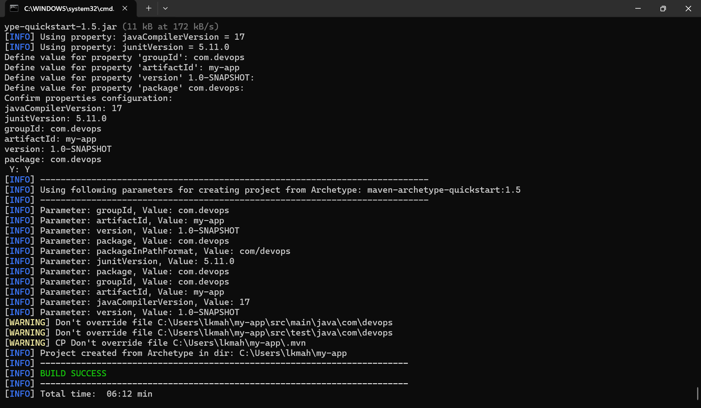
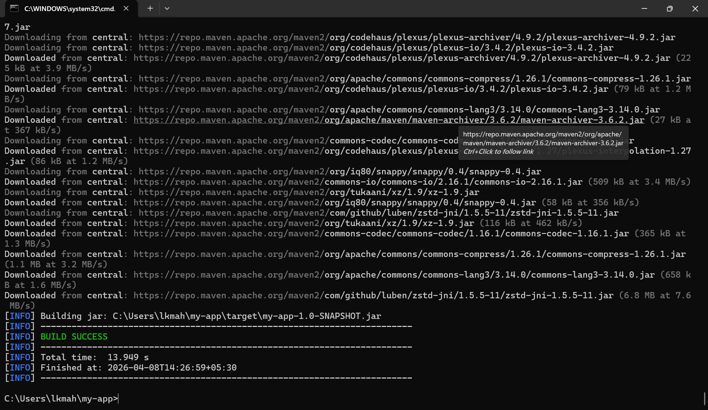
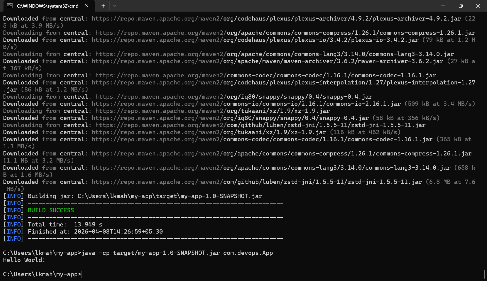
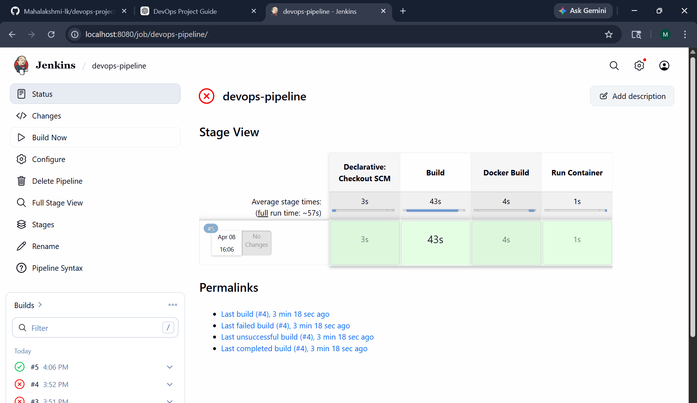
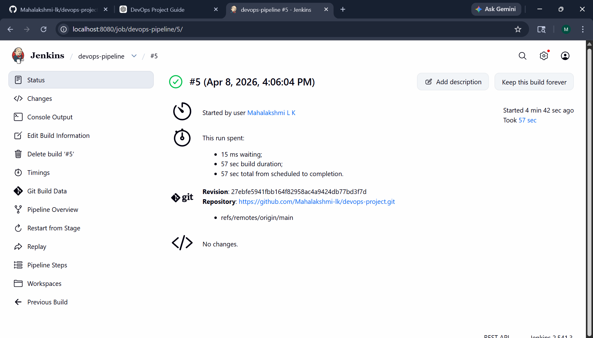
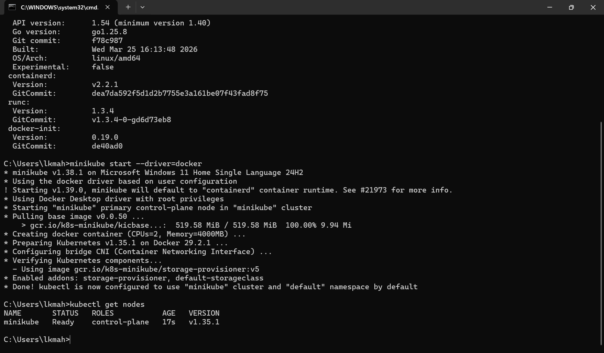
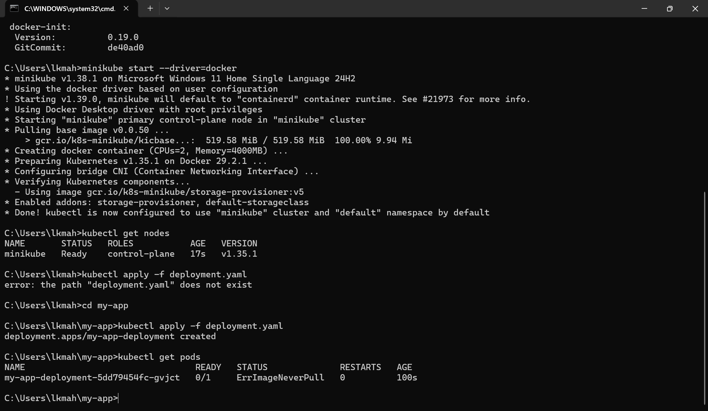
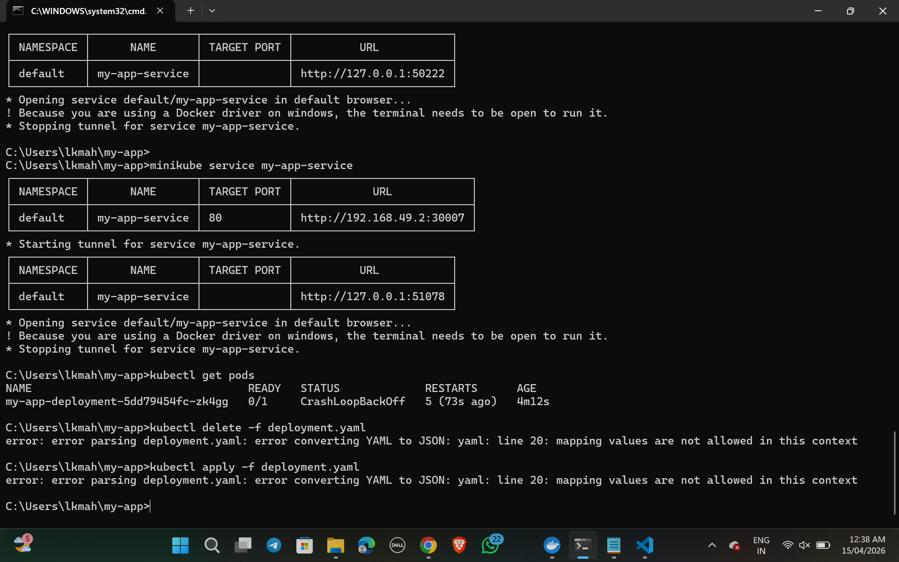

# 🚀 DevOps Project - Java App with Maven

## 📌 Project Overview

This project demonstrates a simple Java application built using Maven and version controlled with Git. It is the first step towards building a complete DevOps pipeline.

---

## 🛠️ Tools Used

* Java 17
* Maven
* Git
* GitHub

---

## ⚙️ Steps Performed

### 1️⃣ Project Creation

* Created a Maven project using archetype
* Defined groupId and artifactId

### 2️⃣ Build Project

* Used Maven command:

```
mvn clean package
```

### 3️⃣ Run Application

```
java -cp target/my-app-1.0-SNAPSHOT.jar com.devops.App
```

---

## 📸 Screenshots

### 🔹 Project Creation



### 🔹 Build Success



### 🔹 Application Output



---

## 🎯 Output

```
Hello World!
```

---

## ⚙️ CI/CD Pipeline (Jenkins)

- Integrated GitHub repository with Jenkins
- Automated build using Maven
- Docker image creation
- Container execution using Docker

### 📸 Jenkins Pipeline



### 📸 Build Details



---

## 🐳 Docker Setup

- Created Dockerfile for Java application
- Built Docker image using:

---

## ☸️ Kubernetes Deployment

This project is deployed on Kubernetes using Minikube.

---

### 📦 Deployment

The application is deployed using a Kubernetes Deployment configuration.

Command used:
kubectl apply -f deployment.yaml

---

### 🌐 Service Exposure

The application is exposed using a NodePort service.

Command used:
kubectl apply -f service.yaml


To access the application:
minikube service my-app-service

---

### 📊 Kubernetes Status

Check cluster and resources:
kubectl get nodes
kubectl get pods
kubectl get services

---

## 📸 Kubernetes Screenshots

### 🔹 Nodes



### 🔹 Pods Running



### 🔹 Service Running



---

## 🎯 Result

The application is successfully deployed and running on Kubernetes using Minikube.

---

